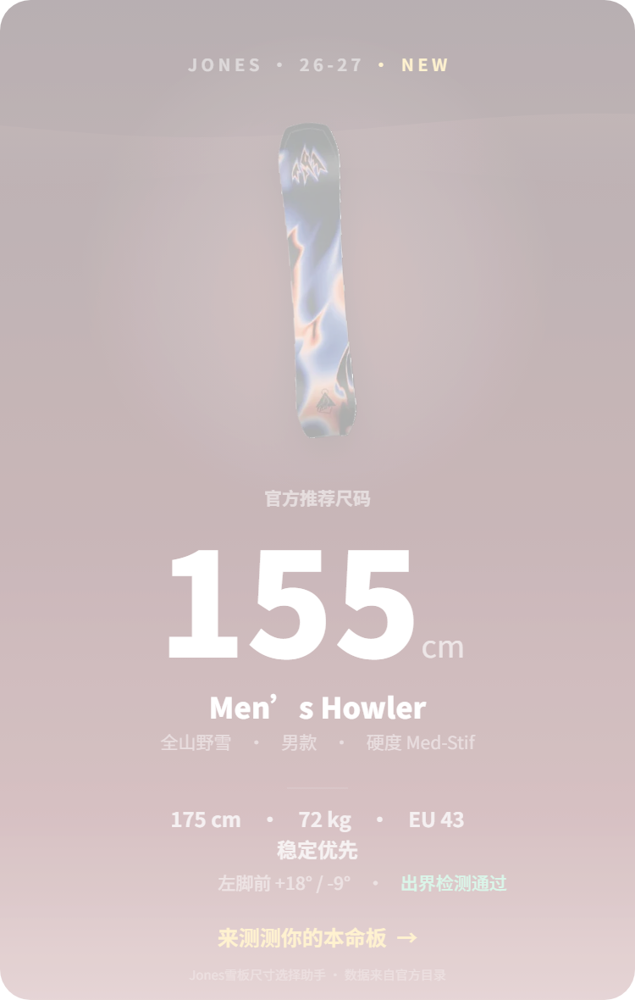

# Snowboard-Size-Chooser-Rednote

**26-27 Jones 雪板尺码选择助手** —— 一个面向小红书（Rednote）的离线 H5 小工具。

输入身高、体重、鞋码与滑行偏好，基于 **Jones Snowboards 2026-27 官方目录**的完整规格表（46 款雪板），为你推荐最合适的板长，并可视化检测站姿出界（Boot Overhang），一键生成分享卡片。



---

## ✨ 功能特性

- **型号选择**：覆盖 26-27 全系 46 款雪板（男款 / 女款 / 通用 / 儿童，含分离板与 W / UW / Big Horn 加宽尺码），附带官方产品图、文案与定位评分
- **身体数据**：身高（120–205 cm）与体重（20–120 kg）滑杆输入；欧码鞋码可选；站姿角度（Regular / Goofy、前后脚角度）可选，内置均衡之道、八字刻滑、一顺刻滑等常用预设
- **滑行偏好**：均衡 / 灵活优先 / 稳定优先；亦可通过滑行风格（刻滑、道内、道外、全山自由式、自由式、公园、平花）自动匹配偏好
- **智能推荐**：先按官方体重区间筛选，再按鞋码覆盖与板腰宽度筛选；多个尺码都合适时取中间档，灵活 / 稳定偏好只向相邻短 / 长档移动；成人身高仅作轻量修正，儿童仍以体重为主
- **站姿出界检测**：按官方腰宽与站位处板宽，估算前后脚在给定角度下的出界量，Canvas 可视化并给出贴边 / 正常 / 偏大 / 明显四级判定
- **结果透明**：推荐附一句话理由、完整官方规格表、备选尺码，支持手动改码对比
- **分享卡片**：Canvas 生成分享图；在小红书 App 内可直接保存相册并唤起发笔记，浏览器内打开亦可正常试算
- **纯前端离线运行**：零依赖、无外部资源请求（符合小红书小工具打包规范），移动端优先设计，ES2017 基线

## 🧮 推荐逻辑（简述）

1. **体重筛选**：优先保留落在官方体重区间内的尺码；若全部超出，则取距离官方区间最近的一组；
2. **鞋码与板宽筛选**：有鞋码时优先保留官方鞋码覆盖的尺码；EU 44 以上再校验 Jones 官方建议的最小板腰（官方宽度表优先于目录鞋码区间，覆盖 EU 44 与 W 版 euMin 44.5 之间的空档），避免仅靠 Big Horn 加分跳到过长尺码；EU 44 以下不主动推荐 W/UW 加宽版（体重档内确无常规尺码时除外）；
3. **中间档取舍**：多个尺码同时合适时，均衡取中间档，灵活优先取短一档，稳定优先取长一档；成人身高只在候选明显偏离时轻推一档，儿童不使用成人身高修正；
4. **出界估算**：由欧码推算 Mondo 脚长与鞋底投影，对比板腰宽及站位处实际板宽（侧切插值），仅作信息展示、不参与尺码筛选。

## 📦 目录结构

```
├── minitool/                  # H5 小工具成品（小红书 zip 的内容源）
│   ├── index.html             # 单页应用入口
│   └── assets/
│       ├── main.js            # 主逻辑：推荐算法、出界估算、分享卡片
│       ├── style.css          # 样式（雪山夜景背景 + 飘雪动画）
│       ├── data.js            # 由 tools/build_data.py 生成的规格数据
│       └── boards/            # 雪板产品图（webp）
├── data/                      # 自官方目录 PDF 提取的原始数据
│   ├── jones-specs.json       # 46 款雪板完整规格（板腰/边刃/侧切/站姿/体重区间等）
│   ├── jones-copy.json        # 官方产品文案（卖点、评分、板型等）
│   ├── jones-specs.md         # 人类可读版规格总表
│   └── boards_raw/            # 原始产品图
├── tools/                     # 数据管线与开发工具（Python 3）
│   ├── extract_jones_specs.py # PyMuPDF 从目录 PDF 提取规格表
│   ├── extract_board_copy.py  # 提取官方产品文案
│   ├── extract_board_images.py# 提取产品图
│   ├── remove_bg.py           # 产品图去背景
│   ├── check_specs.py         # 数据质量校验（字段完整性、taper 一致性等）
│   ├── recheck_specs.py       # 复核校验
│   ├── gen_specs_md.py        # 生成 Markdown 规格总表
│   ├── build_data.py          # data/*.json + 文案 -> minitool/assets/data.js
│   └── dev_server.py          # 本地开发服务器（SSE 热刷新）
├── dist/
│   └── jones-26-27-size-helper.zip  # 上传小红书的小工具压缩包（约 290 KB）
├── card_v3.png                # 分享卡片样式预览
└── LICENSE                    # MIT License
```

## 🚀 本地开发

仅需 Python 3（开发服务器与数据脚本均为标准库 / PyMuPDF，前端零依赖）：

```bash
# 1. 启动开发服务器（保存文件后浏览器自动刷新）
python tools/dev_server.py
# 打开 http://127.0.0.1:8734/

# 2. 修改 data/ 下 JSON 后，重新生成 minitool/assets/data.js
python tools/build_data.py

# 3. 数据质量校验
python tools/check_specs.py
```

> 前端运行环境基线为 ES2017（Chrome 61），请勿使用更新的语法特性。

## 📲 发布到小红书

1. `python tools/build_data.py` 确保数据最新；
2. 将 `minitool/` 目录内容（`index.html` + `assets/`）打包为 zip（入口必须为根目录 `index.html`，所有资源须为本地相对引用）；
3. 将压缩包作为小工具上传至小红书，发布笔记后读者即可在小红书内直接使用。

当前构建产物为 [`dist/jones-26-27-size-helper.zip`](dist/jones-26-27-size-helper.zip)。

## 📚 数据来源

全部规格与产品文案提取自 **Jones Snowboards 2026-27 官方中文目录**（规格表 p134–138、系列总览 p30–31、Big Horn 速查表 p133），提取与校验脚本见 `tools/`。

## ⚠️ 免责声明

本项目为非官方粉丝作品，与 Jones Snowboards 无 affiliation。推荐结果仅供参考，实际选购请以官方建议、实体试滑感受及店员意见为准。

## 📄 License

[MIT](LICENSE) © 2026 HunterH
